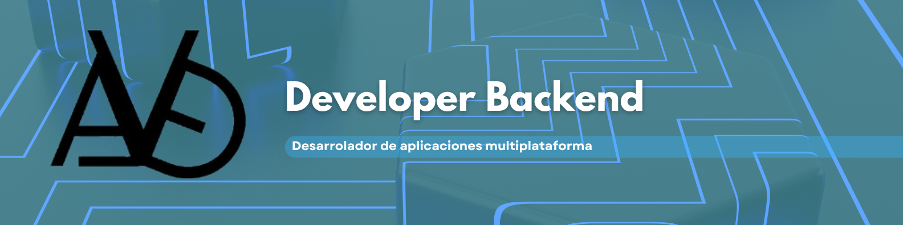

# ¡Hola! Soy Antonio David 👋 

### 🚀 Sobre mí
- 🎮 Actualmente desarrollando un **juego de "¿Quién quiere ser millonario?"** en Java.
- ♿ Enfocado en crear interfaces **dinámicas y accesibles (A11y)**.
- 🛠️ Amante del código limpio y la arquitectura sólida.

## 🛠️ Mi Stack Tecnológico

### 🧠 Lenguajes de programación

### ⚙️ Tecnologías y Frameworks

### 🗄️ Bases de Datos y Cloud

### 🔧 Herramientas

---

## 📊 Estadísticas

  
  

---
📫 **¡Conectemos!**
[Tu LinkedIn](https://www.linkedin.com/in/antonio-david-fern%C3%A1ndez-de-gomar-9a8212331/) | [Tu Portfolio](https://antoniodavid.vercel.app/)
